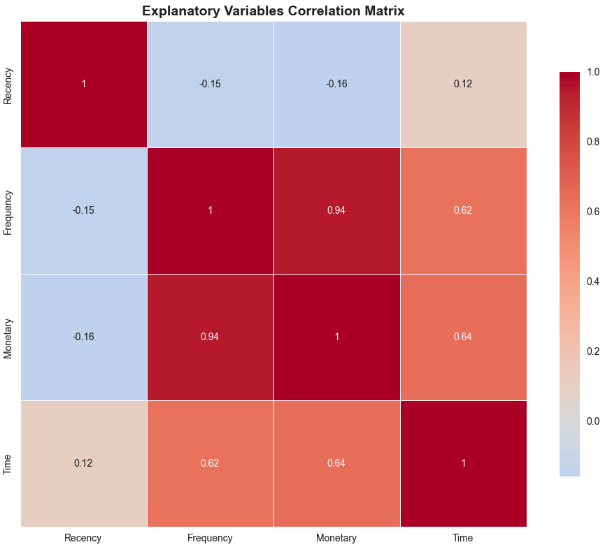

# Machine Learning for Blood Donation Prediction

## Project Description

This machine learning project aims to predict whether a person will donate blood or not using advanced classification algorithms and data analysis techniques. The goal is to develop a predictive model that can help blood transfusion centers better target their awareness campaigns.

## Objectives

- **Prediction** : Develop a model capable of predicting the probability that a person will donate blood
- **Analysis** : Understand the factors that influence blood donation behavior
- **Optimization** : Identify population segments most likely to donate

## Dataset

The dataset contains **748 observations** with the following variables:

| Variable | Description | Type |
|----------|-------------|------|
| **Recency** | Time in months since the last time a person intended to give blood | Numeric |
| **Frequency** | Number of times a person intended to give blood in the past | Numeric |
| **Monetary** | Amount of blood given in the past | Numeric |
| **Time** | Time in months since the first time a person intended to give blood | Numeric |
| **Class** | Target variable (donated/not donated) | Categorical |

### Dataset Statistics
- **Size** : 748 observations × 5 variables
- **Class distribution** : ~76% donated, ~24% not donated
- **Missing values** : Treated and cleaned

## 🔬 Methodology

### 1. Exploratory Data Analysis (EDA)
- Analysis of variable distributions
- Outlier detection
- Correlation analysis
- Visualization of patterns by class

### 2. Data Preparation
- Missing value cleaning
- Categorical variable encoding
- Feature normalization
- Train/test split (80/20)

### 3. Modeling
Several machine learning algorithms were tested with class imbalance handling:

| Model | Accuracy | AUC Score | F1-Score | Precision | Recall | CV Score | Advantages |
|-------|----------|-----------|----------|-----------|--------|----------|------------|
| **Gradient Boosting** | 78.67% | 81.98% | 73.44% | 80.46% | 72.80% | 76.76% | Best overall performance |
| **Random Forest** | 74.00% | 77.35% | 56.86% | 74.61% | 51.05% | 70.06% | Good accuracy, balanced |
| **Logistic Regression** | 66.67% | 85.35% | 64.48% | 65.42% | 69.07% | 63.55% | Best AUC, good recall |
| **SVM** | 66.67% | 84.85% | 55.34% | 59.05% | 56.94% | 68.57% | Good generalization |
| **Decision Tree** | 64.67% | 80.25% | 73.60% | 74.70% | 77.68% | 59.37% | Best F1-score, interpretable |

### 4. Evaluation
- **Metrics used** : Accuracy, AUC Score, Precision, Recall, F1-Score (macro)
- **Class imbalance handling** : SMOTE oversampling + class_weight='balanced'
- **Cross-validation** : 5-fold cross-validation
- **Confusion matrix** : Analysis of classification errors

## Key Results

### Model Performance Summary
- **Best Overall** : Gradient Boosting (78.67% accuracy, 81.98% AUC, 73.44% F1-score)
- **Best AUC Score** : Logistic Regression (85.35% AUC)
- **Best F1-Score** : Decision Tree (73.60% F1-score)
- **Best Precision** : Gradient Boosting (80.46% precision)
- **Best Recall** : Decision Tree (77.68% recall)

### Performance Insights
- **Gradient Boosting** emerged as the best overall performer with balanced metrics
- **Logistic Regression** achieved the highest AUC, indicating excellent probability calibration
- **Decision Tree** showed the best F1-score and recall, good for detecting minority classes
- **Class imbalance handling** significantly improved model performance on minority classes
- **SMOTE + class_weight** combination proved effective for handling severe imbalance

## Visualizations

The project includes numerous visualizations:

### Variable Distribution
Distribution analysis of all features in the dataset:

### Box Plot Analysis
Detection of outliers and data dispersion:

### Correlation Matrix
Heatmap showing relationships between variables:

### Model Performance Comparison
Comparative analysis of all tested models:

### Feature Importance
Importance of each feature in the prediction model:

## 🛠️ Technologies Used

- **Python 3.8+**
- **Pandas** - Data manipulation
- **NumPy** - Numerical calculations
- **Matplotlib/Seaborn** - Visualizations
- **Scikit-learn** - Machine learning
- **Jupyter Notebook** - Development environment

## Implemented Algorithms

### Supervised Learning
- **Logistic Regression** - Interpretable linear model
- **Decision Tree** - Decision tree with max_depth=3
- **Random Forest** - Ensemble of 100 trees
- **Gradient Boosting** - Gradient boosting
- **Support Vector Machine** - SVM with RBF kernel

### Evaluation Techniques
- **Train/Test Split** - 80/20 division
- **Cross-Validation** - 5-fold CV
- **Stratified Sampling** - Preserving proportions
- **Feature Scaling** - StandardScaler for certain models

## Insights and Conclusions

### Key Findings
1. **Gradient Boosting** emerged as the best overall performer with balanced metrics
2. **Logistic Regression** provided the most reliable probability estimates (85.35% AUC)
3. **Decision Tree** showed excellent recall (77.68%) for minority class detection
4. **Class imbalance handling** was crucial for achieving good performance
5. **SMOTE + class_weight** combination proved highly effective

### Model Selection Recommendations
- **For production deployment** : Use Gradient Boosting (78.67% accuracy, 73.44% F1-score)
- **For probability estimation** : Use Logistic Regression (85.35% AUC)
- **For minority class detection** : Use Decision Tree (77.68% recall, 73.60% F1-score)
- **For balanced precision** : Use Gradient Boosting (80.46% precision)
- **For interpretability** : Use Decision Tree (highly interpretable rules)
